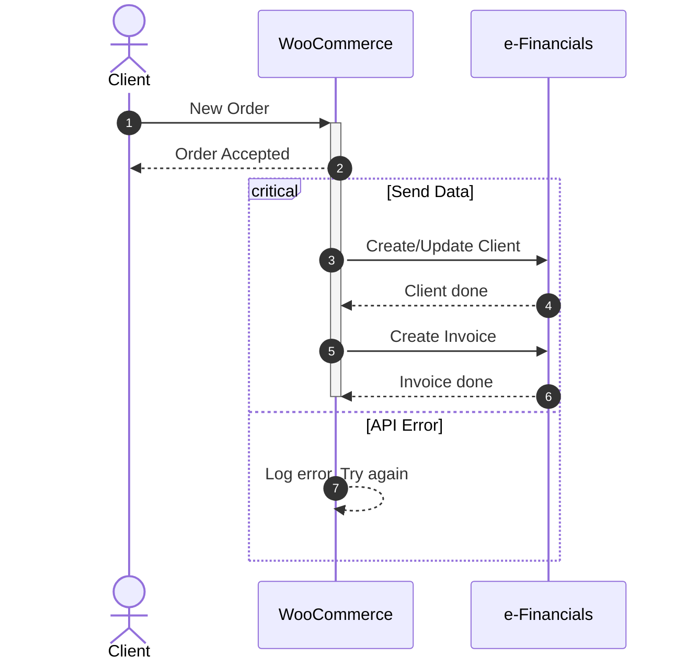

# TODO

## Sequences
Main goal of the integration is to be invisible for the end user. This means, that everything is set up so that the reponses to client are immidiate. Processing and sending data to e-Financials will happen in the background.

### New Order

### Products
Products are syncronised using a custom WooCommerce Product field and e-Financials `products_id` field (this field is not visible in e-Financials interface). Store administrators will see a fancy selection, with product name & code. As there is no "last modified date" field in e-Financials, admins will be able to select which environment takes priority when syncronising products.

### Invoicing
Custom invoices genereted by WooCommerce can be attached to sales invoices in e-Financials automatically. You can also do it the other way around - once the invoice has been created in e-Financials you can send the genereted PDF to the client.

### Invoice Series
Invoice series can be synced to align invoice numbers in WooCommerce and e-Financials.
