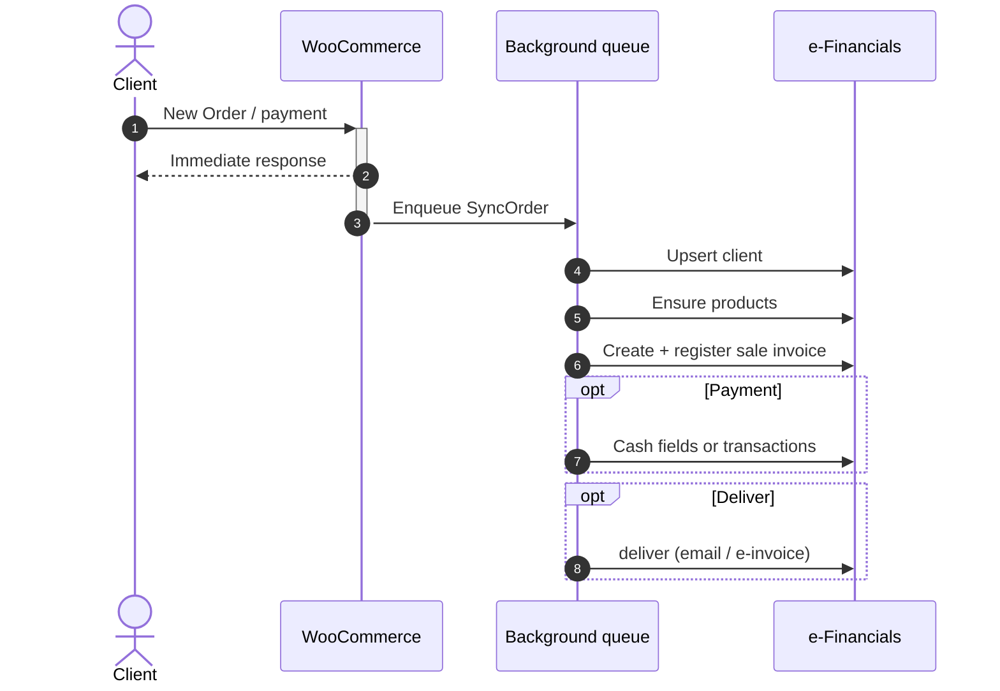

# e-Financials WooCommerce integration

WooCommerce → [e-Arveldaja / e-Financials](https://e-arveldaja.rik.ee/) bookkeeping sync.

**Workflow map** (Accountants.Contact + Merit Aktiva hooks → OpenAPI → `e-financials/php-client`): see [`docs/accounting-workflow.md`](docs/accounting-workflow.md).

API traffic goes through [`e-financials/php-client`](https://github.com/aanndryyyy/e-financials-php-client) (`composer require e-financials/php-client` once published on Packagist; until then Composer uses the GitHub VCS repository).

## What this plugin does

Background (Action Scheduler / WP-Cron) sync so checkout stays fast:

1. **Client upsert** → e-Financials `clients`
2. **Products ensure** → `products` (required `products_id` on invoice rows)
3. **Sale invoice** create + **register**
4. **Payment recording** — cash fields and/or `transactions` (gateway-agnostic; uses WC payment method ids)
5. **Optional deliver** — email PDF / e-invoice
6. **Credit invoices** on full/partial refunds
7. **Admin UX** — settings, order column, metabox PDF, order actions, email note

Configure under **WooCommerce → Settings → Integrations → e-Financials** (credentials, invoice series, template, payment mode map, deliver toggles).

## Sequences

Main goal of the integration is to be invisible for the end user. Processing and sending data to e-Financials happens in the background.

### New Order

```mermaid
sequenceDiagram
	autonumber
	actor C as Client
	participant WC as WooCommerce
	participant Q as Background queue
	participant eF as e-Financials

	C->>+WC: New Order / payment
	WC-->>C: Immediate response
	WC->>Q: Enqueue SyncOrder
	deactivate WC
	Q->>eF: Upsert client
	Q->>eF: Ensure products
	Q->>eF: Create + register sale invoice
	opt Payment
		Q->>eF: Cash fields or transactions
	end
	opt Deliver
		Q->>eF: deliver (email / e-invoice)
	end
```

### Products

Products are synchronised using product meta `_ef_products_id` and e-Financials `products_id`. Opt-in auto-sync on product save is available in settings. Shipping/fees use shared generic products (`WC-SHIP`, `WC-FEE`).

### Invoicing

Sale invoices are created via the OpenAPI client, then registered. System PDFs can be downloaded from the order screen. Optional auto-deliver emails the customer after register.

### Invoice Series

Choose invoice series + template in settings before the first sync. The series' number prefix is sent as `number_prefix`, so invoices follow the accountant's numbering. Optionally push the WooCommerce order number as `number_suffix` — it is reduced to digits, because the API rejects non-numeric invoice numbers.

### VAT

Line VAT rates are read from WooCommerce's own tax rows; nothing is inferred from the tax/net ratio. e-Financials books VAT by *sale article*, not by the row's `vat_rate`, so a mixed-rate catalogue needs the **VAT rate → sale article map**. A sync fails loudly rather than posting tax into the wrong VAT-return bucket when a line's rate does not match its article.

The default sale article is **required**: `products/create` is rejected with "Please select sales account or purchases account" without it.

### Refund credit invoices

A refund posts a credit sale invoice linked to the original. Three undocumented API rules
govern it, all verified end-to-end against the demo tenant (2026-08-03):

- `sale_invoice_type` comes from `EFinancialsClient\Enums\SaleInvoiceType`, which spells the
  value the server actually branches on — hyphenated `CREDIT-INVOICE`. The field is neither
  documented nor validated, so any other spelling skips the credit branch, the credit number
  is never derived, and the request dies with HTTP 500 (`null value in column "number"`). An
  earlier revision of this plugin sent `CREDIT_INVOICE`, which is what that 500 was; it is
  not a server bug.
- The credit repeats the **original's** `number_suffix`. The server derives the number
  itself by appending `K` — and `K2`, `K3`, … for further partial credits against the same
  original, so multiple partial refunds are safe.
- The credited quantity carries the sign: `amount` is negative, `unit_net_price` positive.
  The server recomputes the row and invoice totals as negative.

Over-crediting is refused per row with a 409, and voiding a credit does not give the
capacity back. API error text is sanitised and truncated before it reaches an order note,
so the raw server traceback is never shown to customers.

## Demo in WordPress Playground

Every pull request gets a one-click, throwaway demo of that branch in
[WordPress Playground](https://developer.woocommerce.com/2025/01/24/demo-your-woo-extension-with-wordpress-playground/):
WordPress runs in the browser via WebAssembly, with WooCommerce, this plugin, demo products,
a customer and three orders in different states. The store is seeded as an Estonian shop
(EUR, 22% VAT) and the WooCommerce setup wizard is skipped, so the demo lands directly on the
e-Financials integration settings.

- `blueprints/blueprint.json` — the Playground blueprint (site setup + demo data). Edited by
  hand; the trunk build is pinned to `playground-builds/main.zip`.
- `.github/workflows/playground.yml` — builds the plugin zip (with `vendor/`, without dev
  files), publishes it to the orphan `playground-builds` branch, and comments the demo link
  on the pull request.

The zip is served from `raw.githubusercontent.com` because Playground fetches it from the
browser and that host sends `access-control-allow-origin: *`. `playground.wordpress.net`'s
own `plugin-proxy` is not an option here — it only allowlists the `wordpress`, `automattic`
and `woocommerce` organisations.

**No e-Financials API calls happen in Playground.** The plugin talks to the API over Guzzle,
which does not reach the network from WebAssembly, so the demo covers the admin UI, settings
and order screens — not live syncing.
