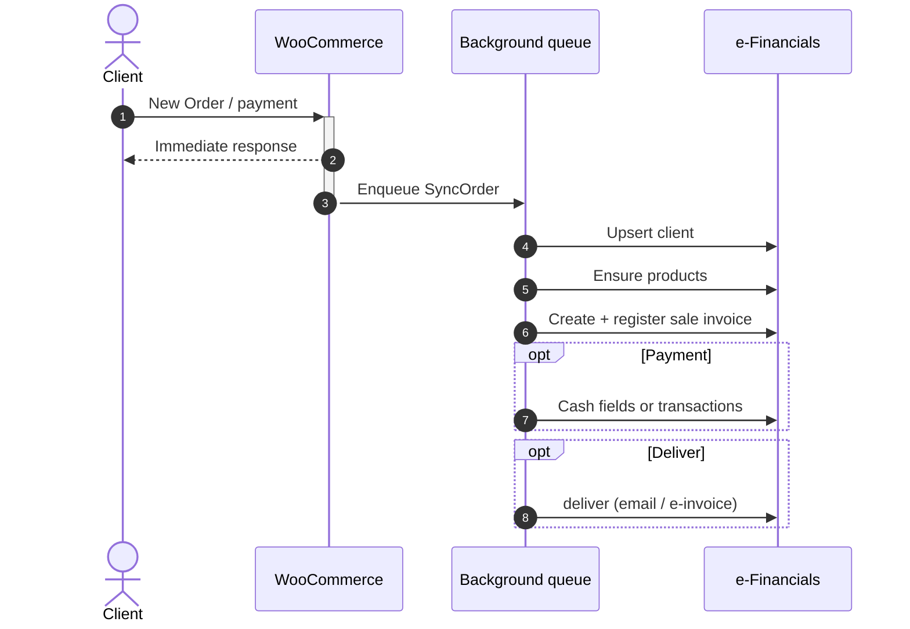

# e-Financials WooCommerce integration

WooCommerce → [e-Arveldaja / e-Financials](https://e-arveldaja.rik.ee/) bookkeeping sync.

**Workflow map** (Accountants.Contact + Merit Aktiva hooks → OpenAPI → `e-financials/php-client`): see [`docs/accounting-workflow.md`](docs/accounting-workflow.md).

API traffic goes through [`e-financials/php-client`](https://github.com/aanndryyyy/e-financials-php-client) (`composer require e-financials/php-client` once published on Packagist; until then Composer uses the GitHub VCS repository).

## What this plugin does

Background (Action Scheduler / WP-Cron) sync so checkout stays fast:

1. **Client upsert** → e-Financials `clients`
2. **Products ensure** → `products` (required `products_id` on invoice rows)
3. **Sale invoice** create + **register**
4. **Payment recording** — cash fields and/or `transactions` (gateway-agnostic; uses WC payment method ids)
5. **Optional deliver** — email PDF / e-invoice
6. **Credit invoices** on full/partial refunds
7. **Admin UX** — settings, order column, metabox PDF, order actions, email note

Configure under **WooCommerce → Settings → Integrations → e-Financials** (credentials, invoice series, template, payment mode map, deliver toggles).

## Sequences

Main goal of the integration is to be invisible for the end user. Processing and sending data to e-Financials happens in the background.

### New Order

```mermaid
sequenceDiagram
	autonumber
	actor C as Client
	participant WC as WooCommerce
	participant Q as Background queue
	participant eF as e-Financials

	C->>+WC: New Order / payment
	WC-->>C: Immediate response
	WC->>Q: Enqueue SyncOrder
	deactivate WC
	Q->>eF: Upsert client
	Q->>eF: Ensure products
	Q->>eF: Create + register sale invoice
	opt Payment
		Q->>eF: Cash fields or transactions
	end
	opt Deliver
		Q->>eF: deliver (email / e-invoice)
	end
```

### Products

Products are synchronised using product meta `_ef_products_id` and e-Financials `products_id`. Opt-in auto-sync on product save is available in settings. Shipping/fees use shared generic products (`WC-SHIP`, `WC-FEE`).

### Invoicing

Sale invoices are created via the OpenAPI client, then registered. System PDFs can be downloaded from the order screen. Optional auto-deliver emails the customer after register.

### Invoice Series

Choose invoice series + template in settings before the first sync. The series' number prefix is sent as `number_prefix`, so invoices follow the accountant's numbering. Optionally push the WooCommerce order number as `number_suffix` — it is reduced to digits, because the API rejects non-numeric invoice numbers.

### VAT

Line VAT rates are read from WooCommerce's own tax rows; nothing is inferred from the tax/net ratio. e-Financials books VAT by *sale article*, not by the row's `vat_rate`, so a mixed-rate catalogue needs the **VAT rate → sale article map**. A sync fails loudly rather than posting tax into the wrong VAT-return bucket when a line's rate does not match its article.

The default sale article is **required**: `products/create` is rejected with "Please select sales account or purchases account" without it.

### Known limitation: refund credit invoices

`sale_invoice_type=CREDIT_INVOICE` currently fails server-side on the demo tenant with
`null value in column "number" of relation "sale_invoices" violates not-null constraint`,
reproduced with a valid `number_prefix` and a numeric `number_suffix` (2026-08-03). The
refund path is implemented and its amounts are unit-tested, but it cannot succeed until RIK
resolves this or documents the `credit_invoices` / `credit_invoice_payment_type` fields.
API error text is sanitised and truncated before it reaches an order note, so the raw
server traceback is no longer shown to customers.
