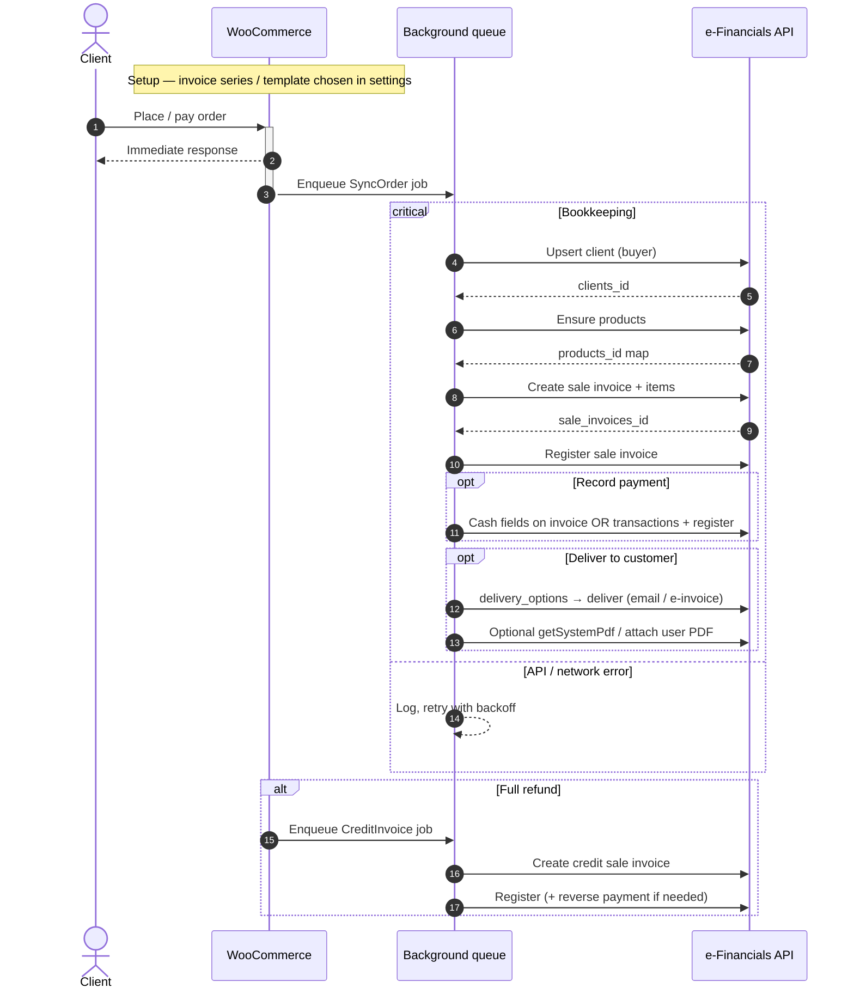

# Accounting workflow map

Reference comparison of **Accountants.Contact Sync for WooCommerce** and **Orders Synchronization for Merit Aktiva**, mapped onto the [e-Financials OpenAPI](https://rmp-api.rik.ee/openapi.yaml) and the [`e-financials/php-client`](https://github.com/aanndryyyy/e-financials-php-client) package.

Goal for this plugin: keep checkout/admin responses immediate; push bookkeeping work to the background (see root README sequence).

---

## 1. WooCommerce hook map (reference plugins)

### Accountants.Contact Sync

Event-driven, HPOS-aware, ~1.1k LOC. Sync runs in the request that fires the WC hook (no Action Scheduler / cron).

| Concern | Hook / entry | Behaviour |
| --- | --- | --- |
| Boot / HPOS | `before_woocommerce_init` | `FeaturesUtil::declare_compatibility( 'custom_order_tables', … )` |
| Boot | `plugins_loaded` | Load settings, client, order sync, products, admin if WC active |
| **Order → invoice** | `woocommerce_payment_complete` | Primary: gateway confirms payment → build payload → API create invoice |
| **Order → invoice (fallback)** | `woocommerce_order_status_completed` | Safety net when payment never fired `payment_complete` |
| Idempotency | order meta `_acwc_invoice_id` | Skip if already linked; server also dedupes on `external_ref` (`WC-{id}`) |
| Manual resend | `woocommerce_order_actions` + `woocommerce_order_action_acwc_send` | Order-edit action “Send to Accountants.Contact” |
| Orders list UI | `manage_edit-shop_order_columns` / `manage_woocommerce_page_wc-orders_columns` (+ render) | Invoice number column (legacy + HPOS) |
| Settings | `woocommerce_settings_tabs_array` + `woocommerce_settings_{tab}` / `_save_` | WC Settings tab; connection ping on save |
| **Product export** | `woocommerce_new_product` / `woocommerce_update_product` | Opt-in auto-export on save |
| Product bulk | `admin_post_acwc_export_all` / `admin_post_acwc_import_all` | Settings-page bulk import/export |
| Plugins row | `plugin_action_links_*` | Settings shortcut |

**Order payload shape (conceptual):** customer (name/email/phone/address) + tax-inclusive lines (products, shipping, fees) + optional payment block (bank code, amount, date) + `external_ref`.

**Product payload:** SKU → code, name, description, sell price (cents), tax/income codes; store `_acwc_item_id`.

### Merit Aktiva Sync

Cron + status-driven, Estonian-market features, larger surface.

| Concern | Hook / entry | Behaviour |
| --- | --- | --- |
| Schedule | `cron_schedules` + `init` / activator | Custom `every_5_minutes` → `merit_aktiva_auto_sync` |
| **Order → invoice** | `woocommerce_order_status_changed` | If `$new_status ===` configured status → `create_invoice()` |
| **Refund → credit** | same hook | If `$new_status === 'refunded'` → `create_credit_invoice()` |
| Cron safety net | `merit_aktiva_auto_sync` | All orders in configured status without `_merit_invoice_sent_at`; backoff after 3 full failures |
| Manual single | `wp_ajax_sync_invoice` / `merit_force_resend` | Metabox / AJAX |
| Manual bulk | `wp_ajax_merit_sync_all_orders` | Settings “sync all” |
| PDF | `wp_ajax_merit_download_pdf` | Fetch Merit PDF onto order screen |
| Orders UI | HPOS + legacy column/filter/bulk hooks | Merit sent badge, filter, bulk send |
| Checkout B2B | `woocommerce_init` → `woocommerce_register_additional_checkout_field` | Company / registry code / VAT |
| Admin order | `woocommerce_admin_order_data_after_billing_address` | Show B2B fields |
| Email note | `woocommerce_email_after_order_table` | Mention Merit invoice |
| Settings | custom admin menu + AJAX test/reconcile/import-export | Not a WC Integrations tab |

**Idempotency:** `_merit_invoice_sent_at` order meta (+ order note). Cron skips when present.

---

## 2. Shared accounting workflow (canonical steps)

Both plugins implement the same core loop. Ours should follow this shape, with **async execution** (Action Scheduler / WC queue) so the storefront stays fast.



| Step | Accountants.Contact | Merit Aktiva | e-Financials target |
| --- | --- | --- | --- |
| 0. Series / template | — | — | **invoice_series** + template in settings (P0 setup) |
| 1. Trigger | `payment_complete` / `completed` | Configurable status + 5‑min cron | ACWC triggers + Merit-style queue/cron retry |
| 2. Guard | meta `_acwc_invoice_id` + `external_ref` | meta `_merit_invoice_sent_at` | `_ef_sale_invoice_id`, `_ef_clients_id`; refuse duplicates |
| 3. Customer | Embedded in invoice payload | Built into Merit invoice body | Explicit **clients** upsert first |
| 4. Products | Optional item sync by SKU | Line codes on invoice | **products** ensure; rows require `products_id` |
| 5. Invoice | Single “create invoice” API | `sendinvoice` | **sale_invoices** create (+ `items[]`) then **register** |
| 6. Payment | Optional “record as paid” | Payment method → Merit payment code | **Cash fields** and/or **transactions** (see §3.5) |
| 7. Credit / refund | — | Full refund → credit invoice | Credit sale invoice (`credit_sale_invoices_id`) — **in scope** |
| 8. PDF / deliver | — | Download Merit PDF | `getSystemPdf` + `deliver` — **in scope** |
| 9. Admin UX | Settings tab, orders column, order action | Metabox, column, bulk, dashboard | Mirror ACWC minimal UX + PDF/resend actions |

---

## 3. OpenAPI → php-client → WooCommerce data flow

Package: **`e-financials/php-client`** (`EFinancials::client()` / `EFinancials::factory()`).  
Bases: live `https://rmp-api.rik.ee/v1`, demo `https://demo-rmp-api.rik.ee/v1` (factory default).

Auth (handled by client): `X-AUTH-QUERYTIME` + `X-AUTH-KEY` HMAC-SHA-384 over `{apiKeyId}:{queryTime}:{path}`.

### 3.1 Connection / settings

| WC side | Client accessor | OpenAPI |
| --- | --- | --- |
| API key id / public / password + test|live base URI | `EFinancials::factory()->withApiKeyId()->withApiKeyPublic()->withApiKeyPassword()->withBaseUri()` | All authenticated routes |
| Smoke test | `$client->currencies()->all()` or `$client->clients()->all(1)` | `GET /currencies`, `GET /clients` |
| Default template / terms | `$client->templates()->…`, `$client->invoices()->allSettings()` / `all()` | `GET /templates`, `GET|PATCH /invoice_info`, `GET|POST /invoice_series` |
| Sale article / VAT lookups | `$client->salesArticles()->all()`, `$client->bank()` VAT helpers | `GET /sale_articles`, `GET /vat_info`, `GET /bank_accounts` |

Existing plugin settings keys already align: `api_key_id`, `api_key_public`, `api_key_password`, `api_key_environment` (test|live).

### 3.2 Client (buyer) upsert — New Order step 1

| WC source | Map to `Clients` body | Client API | OpenAPI |
| --- | --- | --- | --- |
| Billing name / company | `name`, `is_juridical_entity` / `is_physical_entity` | `$client->clients()->create()` / `update($id)` | `POST /clients`, `PATCH /clients/{id}` |
| Billing email / phone | `email`, `telephone` | | |
| Billing address | `address_text`, `postal_address_text`, `cl_invoice_country` | | |
| Company registry code (future checkout field, cf. Merit) | `code` | | |
| VAT number | `invoice_vat_no` | | |
| Always for shop buyers | `is_client=true`, `is_supplier=false`, `cl_code_country`, `is_member`, `send_invoice_to_email`, `send_invoice_to_accounting_email` | required by client SDK | |
| Match existing | Search `clients()->all(page, modifiedSince)` by email/`code`; store `_ef_clients_id` on order/customer | `GET /clients` | |

**Required create fields (SDK):** `is_client`, `is_supplier`, `name`, `cl_code_country`, `is_member`, `send_invoice_to_email`, `send_invoice_to_accounting_email`.

### 3.3 Product sync (optional) — catalogue

| WC source | Map to `Products` | Client API | OpenAPI |
| --- | --- | --- | --- |
| Name | `name` | `$client->products()->create($name, $code, $params)` | `POST /products` |
| SKU | `code` (max 20) | | |
| Description | `description` | | |
| Regular/price | `sales_price`, `price_currency` | | |
| Tax class / article mapping (settings) | `cl_sale_articles_id` | from `salesArticles()->all()` | `GET /sale_articles` |
| Link | product meta `_ef_products_id` | `get` / `update` / `deactivate` | `GET|PATCH /products/{id}`, deactivate/reactivate |
| Import / reconcile | `products()->all($page, $modifiedSince)` | | `GET /products?modified_since=` |

Invoice rows **require** `products_id`. For orders whose lines lack a linked product, create/find a generic “WooCommerce line” / shipping / fee product first (same pattern Merit uses with coded articles).

### 3.4 Sale invoice — New Order step 2

| WC source | Map to `SaleInvoices` / `SaleInvoicesItems` | Client API | OpenAPI |
| --- | --- | --- | --- |
| Resolved buyer | `clients_id` | from §3.2 | |
| Order number | `number_suffix` (and/or notes / `contract_number`) | `$client->salesInvoices()->create($params)` | `POST /sale_invoices` |
| Dates | `create_date`, `journal_date` from paid/created | | |
| Currency | `cl_currencies_id` (e.g. `EUR`) | | |
| Country of supply | `cl_countries_id` from billing/shipping country | | |
| Template / series | `cl_templates_id`, series via settings | `templates()`, `invoices()` | |
| Terms | `term_days` from series/settings | | |
| Type | `sale_invoice_type: INVOICE` (credit later) | | |
| Balance UI flag | `show_client_balance` | required | |
| Line items | `items[]`: `products_id`, `amount` (qty), `custom_title`, `unit_net_price`, discounts | nested on create/get | schema `SaleInvoicesItems` |
| Shipping / fees | synthetic products or dedicated SKUs | | |
| Order ref | `notes` / `additional_info_content` including `WC-{id}` | | |
| Confirm | after create | `$client->salesInvoices()->register($id)` | `PATCH /sale_invoices/{id}/register` |
| Persist | `_ef_sale_invoice_id`, `_ef_sale_invoice_number` | `get($id)` | `GET /sale_invoices/{id}` |

**Required invoice fields (SDK/OpenAPI):** `sale_invoice_type`, `cl_templates_id`, `clients_id`, `cl_countries_id`, `number_suffix`, `create_date`, `journal_date`, `term_days`, `cl_currencies_id`, `show_client_balance`.

**Required row fields:** `products_id`, `amount`, `custom_title`.

### 3.5 Payment recording — how to implement

e-Financials exposes **two different payment models**. Pick per WC payment method via settings (Merit-style map).

#### Option A — Cash fields on the sale invoice (simplest)

Best for **card / wallet / COD / instant gateways** where the shop already collected money and you only need the invoice marked paid in books.

Set on `POST /sale_invoices` (or `PATCH` before `register`):

| Field | Source |
| --- | --- |
| `paid_in_cash` | `true` when order `is_paid()` and method maps to “cash-like” |
| `cash_payment_date` | `$order->get_date_paid()` (`Y-m-d`) |
| `cash_accounts_id` | Settings: default cash/clearing account (from chart / dimension picker) |
| `cash_accounts_dimensions_id` | Optional dimension for that account |
| `payment_description` | Gateway title + transaction id |

Flow:

1. Create invoice **with** cash fields populated (order already paid).
2. `salesInvoices()->register($id)`.
3. Persist `_ef_payment_mode = cash` (no separate transaction id).

Pros: one API object, matches ACWC “record as paid”.  
Cons: not a proper bank receipt; weaker for bank-transfer / payout reconciliation.

#### Option B — Incoming `transactions` settled against the invoice

Best for **bank transfer / invoice-first / B2B** and for matching Stripe/WP payouts later.

OpenAPI/`Transactions` required create fields: `accounts_dimensions_id`, `type`, `amount`, `cl_currencies_id`, `date`.  
Also set `clients_id`, `description`, optional `ref_number` (WC order / Estonian viitenumber).

```text
1. Create + register sale invoice (unpaid / AR)
2. transactions()->create({
     accounts_dimensions_id: <bank or clearing dimension from settings>,
     type:                 /* incoming payment — confirm live enum with demo */,
     amount:               order total,
     cl_currencies_id:     order currency,
     date:                 paid date,
     clients_id:           buyer,
     description:          "WC order #123 / txn abc",
     ref_number:           bank reference if any
   })
3. transactions()->register($txId, [
     // Distributions link money to the invoice (AR settlement)
     [ 'related_table' => /* sale invoice table name */, 'related_id' => $saleInvoiceId, 'amount' => $total ]
   ])
4. Store _ef_transaction_id
```

`register` accepts `TransactionsDistributions[]` with `related_table`, `related_id`, optional `related_sub_id`, `amount`. Exact `related_table` string for sale invoices must be confirmed against the demo API / RIK docs before shipping (treat as a spike item).

Pros: real payment document; invoice `payment_status` / `settlements` can reflect PAID.  
Cons: more steps; need account-dimension mapping; partial refunds need partial distributions.

#### Option C — Hybrid (recommended default)

| WC payment method class | Mode | Implementation |
| --- | --- | --- |
| Card / PayPal / Stripe / WC Payments / etc. | **Cash fields** | Option A at invoice create |
| BACS / cheque / COD (unpaid at create) | **None at create** | Create unpaid invoice; when `payment_complete` later, Option B or PATCH cash fields then re-check status |
| Manual “mark paid” in admin | **Transaction** | Option B with clearing account |
| Partial payment / multi-capture | **Transaction(s)** | One transaction per WC payment; distribute amounts |

Settings UI (under existing `WC_Integration`):

1. Default payment mode: `cash` | `transaction` | `off`.
2. Per-gateway override map: `payment_method_id` → mode + `cash_accounts_id` **or** `accounts_dimensions_id` (+ optional `bank_accounts_id` for display/ref).
3. Load picklists from `$client->bank()->all()` and `$client->accountDimensions()->all()` / `accounts()->all()`.

Idempotency: if `_ef_transaction_id` or `_ef_payment_mode=cash` already set, skip. On retry after invoice exists but payment failed, only re-run the payment step.

Partial refunds: do **not** use cash fields; create a credit invoice (or negative settlement transaction) for the refunded amount only.

### 3.6 Credit on refund — in scope

| WC source | e-Financials | Client API | OpenAPI |
| --- | --- | --- | --- |
| `woocommerce_order_fully_refunded` / status `refunded` | Credit sale invoice linked to original | `salesInvoices()->create([ 'credit_sale_invoices_id' => $orig, 'sale_invoice_type' => /* credit */, … mirrored negative/credit lines ])` | `POST /sale_invoices` |
| | Register credit | `register($id)` | `PATCH …/register` |
| Partial refund (`woocommerce_order_partially_refunded`) | Credit for refunded lines/amount only | same, amount from `WC_Order_Refund` | |
| Payment reversal | If Option B: outgoing/settlement transaction or credit `paid_in_cash` handling | `transactions()->create` + `register` | `/transactions` |
| Persist | `_ef_credit_sale_invoice_id` (+ list meta for multiple partials) | | |

Guards: require `_ef_sale_invoice_id`; skip if credit already linked for that refund id (`_ef_refund_{refund_id}_credit_id`).

### 3.7 PDF + customer delivery — in scope

| Feature | When | Client API | OpenAPI |
| --- | --- | --- | --- |
| System PDF on order screen | Admin metabox / AJAX after sync | `salesInvoices()->getSystemPdf($id)` | `GET /sale_invoices/{id}/pdf_system` |
| XML export | Optional admin download | `getXml($id)` | `GET …/xml` |
| Attach WC PDF (e.g. packing-slip plugin) | Setting: “upload shop PDF” | `updateFile($id, …)` | `PUT …/document_user` |
| Email PDF to customer | Setting: auto after register, or order action | `getDeliveryOptions` → `deliver` with `send_email`, addresses, subject/body | `GET …/delivery_options`, `PATCH …/deliver` |
| E-invoice (machine XML) | When `can_send_einvoice` | `deliver` with `send_einvoice=true` | same |
| WC email note | `woocommerce_email_after_order_table` | Link/number from meta (Merit pattern) | — |

Auto-deliver only after successful **register**; store `_ef_delivered_at` / last delivery error. Manual order action: “Deliver e-Financials invoice”.

### 3.8 Invoice series — in scope (setup + sync)

| Feature | Client API | OpenAPI | Plugin behaviour |
| --- | --- | --- | --- |
| List series | `$client->invoices()->all()` | `GET /invoice_series` | Settings dropdown “Invoice series” |
| Create / update | `create` / `update` | `POST|PATCH /invoice_series` | Optional “create WC series” helper |
| Read settings | `allSettings` / `updateSettings` | `GET|PATCH /invoice_info` | Company invoice email subject/body defaults for `deliver` |
| Templates | `$client->templates()` | `GET /templates` | Settings: `cl_templates_id` |
| Number alignment | series `number_prefix`, `number_start_value`, `term_days` | | Either: (a) e-Financials owns numbers (`number_suffix` from series), or (b) push WC order number as `number_suffix` when “use WC order number” enabled |
| Persist choice | WP option / integration setting `invoice_series_id` | | Required before first sync |

---

## 4. Recommended hook / job plan for this plugin

Adopt ACWC’s **simplicity** and Merit’s **reliability + Estonian extras**, but route all API I/O through **`e-financials/php-client`** on a background queue.

| Priority | WC hook / entry | Job |
| --- | --- | --- |
| P0 | `before_woocommerce_init` | Declare HPOS compatibility |
| P0 | `plugins_loaded` | Boot DI / services when WC + credentials present |
| P0 | Settings (`WC_Integration`) | Credentials, env, **invoice series**, template, sale article, **payment mode map**, deliver toggles |
| P0 | `woocommerce_payment_complete` | Enqueue `SyncOrderToEFinancials` (client → products → invoice → register → payment → optional deliver) |
| P0 | `woocommerce_order_status_completed` | Enqueue if not yet synced |
| P0 | Action Scheduler / cron fallback | Retry failed jobs; sweep unsynced paid orders |
| P0 | `woocommerce_order_fully_refunded` (+ partial refund hook) | Enqueue `CreditInvoiceToEFinancials` |
| P1 | `woocommerce_new_product` / `woocommerce_update_product` | Opt-in product upsert |
| P1 | `woocommerce_order_actions` | Manual send / resend / **deliver** / **fetch PDF** |
| P1 | Orders list columns (legacy + HPOS) | Invoice number, payment mode, credit badge, error |
| P1 | Admin order metabox | PDF download, delivery status, last error |
| P2 | Checkout additional fields | Registry code + VAT (Merit-style) |
| P2 | `woocommerce_email_after_order_table` | Show e-Financials invoice number / PDF note |

### Suggested order meta

| Meta key | Purpose |
| --- | --- |
| `_ef_clients_id` | Linked e-Financials client |
| `_ef_sale_invoice_id` | Linked sale invoice |
| `_ef_sale_invoice_number` | Human number |
| `_ef_payment_mode` | `cash` \| `transaction` \| `none` |
| `_ef_transaction_id` | Linked payment transaction (Option B) |
| `_ef_delivered_at` | Last successful `deliver` |
| `_ef_synced_at` | Success timestamp (invoice registered) |
| `_ef_last_error` | Last API/validation error |
| `_ef_credit_sale_invoice_id` | Latest credit invoice |
| `_ef_refund_{id}_credit_id` | Per-refund credit link (partials) |

### Suggested product meta

| Meta key | Purpose |
| --- | --- |
| `_ef_products_id` | Linked e-Financials product (`products_id` for invoice rows) |

---

## 5. Client package dependency

```bash
composer require e-financials/php-client guzzlehttp/guzzle
```

- Packagist name: `e-financials/php-client` (publishing pending; Composer `repositories` VCS entry points at GitHub until then).
- PHP **^8.2** (client constraint) — this plugin must match.
- PSR-18 HTTP client required at runtime (Guzzle is the documented choice).

Factory wiring inside the plugin:

```php
$client = \EFinancials::factory()
    ->withApiKeyId( $id )
    ->withApiKeyPublic( $public )
    ->withApiKeyPassword( $password )
    ->withBaseUri( $live ? 'https://rmp-api.rik.ee' : 'https://demo-rmp-api.rik.ee' )
    ->make();

$series   = $client->invoices()->all(); // pick series / term_days in settings
$created  = $client->clients()->create( [ /* … */ ] );
$invoice  = $client->salesInvoices()->create( [
	/* required invoice fields + items[] */
	'paid_in_cash'      => true,           // Option A example
	'cash_payment_date' => '2026-08-02',
	'cash_accounts_id'  => 1010,
] );
$id = (int) $invoice['created_object_id'];
$client->salesInvoices()->register( $id );
// Option B alternative: $client->transactions()->create(…); ->register( $txId, $distributions );
$opts = $client->salesInvoices()->getDeliveryOptions( $id );
$client->salesInvoices()->deliver( $id, [
	'send_einvoice' => false,
	'send_email'    => true,
	/* email_* from invoice_info / order billing */
] );
```

---

## 6. Gap checklist vs reference plugins

| Capability | ACWC | Merit | e-Financials plugin (planned) |
| --- | --- | --- | --- |
| Immediate UX / background work | sync in-request | cron + status | **queue** (README critical path) |
| Client upsert | implicit | implicit | **explicit `clients` API** |
| Product link required on lines | no | coded articles | **yes (`products_id`)** |
| Idempotent order sync | yes | yes | yes |
| Invoice series / template setup | — | — | **yes (P0 settings)** |
| Payment recording | optional paid receipt | payment method map | **cash fields + transactions (P0)** |
| Credit on refund | no | yes | **yes (P0)** |
| PDF from accounting system | no | yes | **yes (P1 admin)** |
| Deliver invoice to customer | no | email note only | **`deliver` auto + manual (P0/P1)** |
| HPOS | yes | yes | yes |
| Estonian reg code / VAT checkout | no | yes | P2 |

### Open spike before coding payments Option B

1. Confirm transaction `type` values for incoming customer payment on demo API.
2. Confirm `related_table` string used when distributing a transaction onto a sale invoice.
3. Verify whether cash-field invoices auto-set `payment_status=PAID` after `register` without a transaction.
